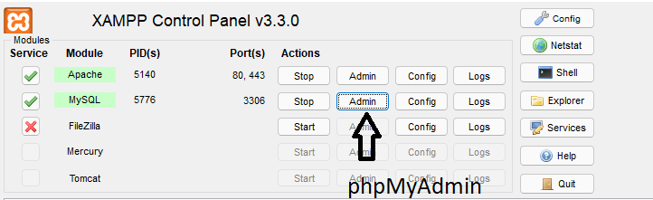

<h1 algin="center">appPHP: Calendario raccolta differenziata</h1>

  
Sommario

  <ol>
    <li>
      <a href="#informazioni-sul-progetto">Informazioni sul progetto</a>
      <ul>
        <li><a href="#costruito-con">Costruito con</a></li>
         <li><a href="#software-utilizzati">Software utilizzati</a></li>
      </ul>
    </li>
   <li><a href="#descrizione">Descrizione</a>
     <ul>
        <li><a href="#struttura-repository">Struttura Repository</a></li>
        <li><a href="#Download-e-testare-app-in-locale">Download e testare app in locale</a></li>
      </ul>
    </li>
   <li><a href="#licenza">Licenza</a></li>
  <ol>

<!-- Informazioni sul progetto-->

## Informazioni sul progetto

La finalità di questo progetto è quella di realizzare una applicazione PHP che aiuti a tenere traccia dei giorni della settimana in cui avviene la raccolta differenziata.

Questa applicazione è stata creata utilizzando il framework Laravel,e un database relazionale SQL

#### <h3>Costruito con:</h3>

<b>Framework</b>:

- [Laravel] (https://laravel.com)
- [Bootstrap] (https://getbootstrap.com/)

<b>Database</b>:

- [MySQL] (https://www.mysql.com/it/)

#### <h3>Software utilizzati</h3>
      
 <b>Gestore di pachetti per linguaggio di programmazione PHP</b>:

- [COMPOSER] (https://getcomposer.org/)
      
 <b> Piattaforma software </b>:
      
 - [XAMPP] (https://www.apachefriends.org/it/index.html)
      
<!--Descrizione-->

## Descrizione

### Struttura Repository

<h4>Directory app</h4>
La directory app contiene il codice principale dell'applicazione

  
Directory app

   <ol>
     <li>
       Folder Console
      </li>
      <li>
        Folder Exceptions
      </li>
      <li>
        Folder Http
      </li>
      <li>
        Folder Models
      </li>
      <li>
        Folder Providers
      </li>
    </ol>

 

<h4>Directory bootsrap</h4>

  La directory bootstrap contiene il file app.php che esegue il bootstrap del framework. Questa directory ospita anche una directory cache  che contiene i file generati dal framework per l'ottimizzazione delle prestazioni come i file della cache di route e servizi.

<h4>Directory config</h4>
 
La directory config, contiene tutti i file di configurazione dell'applicazione.

<h4>Directory database</h4>
 
La directory database contiene la folder migrations nella quale sono ospitate i file di migrazione, le cartelle factories e seeders.

<h4>Directory public</h4>
 
La directory public contiene il index.php file, che è il punto di ingresso per tutte le richieste che entrano nell'applicazione e configura il caricamento automatico. Questa directory ospita anche le tue risorse come immagini, JavaScript e CSS.

<h4>Directory resource</h4>
La directory resources contiene la cartella view nella quale abbiamo le view.
<h4>Directory routes</h4>
Il file web.php contiene i percorsi che RouteServiceProvider inserisce nel gruppo del middleware Web, che fornisce lo stato della sessione, la protezione CSRF e la crittografia dei cookie.
<h4>Directory storage</h4>

La directory storage contiene i log, i modelli Blade compilati, le sessioni basate su file, le cache di file e altri file generati dal framework

<h4>Directory test</h4>

La directory tests contiene i test automatici

<h4>Directory vendor</h4>

La directory vendor contiene le dipendenze di Composer 
 

<h3>Il codice dell'applicazione risiede nelle seguenti folder:</h3>
 <ol>
    <li>app/Http/Controllers: risiedono i vari controllers .
    I controllers possono raggruppare la logica di gestione delle richieste correlata in un'unica classe.
    </li>
    <li>app/Models:contiene i model corrispondente a ciascuna tabella. Ogni Model viene utilizzato per interagire con la rispettiva tabella attraverso Eloquent(mappatore relazionale a oggetti (ORM))
    </li>
    <li>database/migrations: Le migrations consentendo di definire e condividere la definizione dello schema del database dell'applicazione.
    </li>
    <li>public/css/style.css</li>
    <li>public/js/addInput.js</li>
    <li>resources/views: risiedono le varie view dell'app</li>
    <li>routes/web.php

 </ol>

### Funzionalità dell'applicazione
- L'applicazione è costituita da tre view:
  - Schermata Home visualizza il giorno corrente con il relativo conferimento giornaliero e fascia oraria di     ritiro.
  
  - Con la view "CREA CALENDARIO" si puà creare un calendario settimanale.
    Con il pulsante "Aggiungi Riga " si può aggiungere più ritiri per ogni giorno.
    
  - View "Calendario settimanale"
    
### Download e testare app in locale

- Sul proprio dispositivo è necessario installare: 
   - un ambiente di lavoro sul proprio computer per poter eseguire programmi PHP.
     Durante lo sviluppo di questa applicazione ho usato XAMPP è un ambiente di sviluppo web disponibile per Windows, Linux e Mac. Consente di creare applicazioni web con Apache, PHP e MySQL. 
     (https://www.apachefriends.org/it/index.html)
   - [Composer] gestore di pacchetti a livello applicativo per il linguaggio di programmazione PHP (https://getcomposer.org/download/) 
   
- Scaricare il Repository: (https://github.com/Emanuele9326/calendarioRaccoltaDifferenziata)
   
- Sè si utilizza XAMPP come ambiente di sviluppo la cartella del repository appena scaricato deve essere posizionata <b>" c:/xampp/htdocs"</b> directory, in quanto per impostazione predefinita i file vengono serviti da tale directory.
- Aprire la cartella del repository attraverso il prompt dei comandi ed eseguire il comando "composer install".
In questo modo si vanno in automatico ad installare tutte le dipendenze e le librerie di cui necessita l'applicazione.
- Dall'interfaccia di XAMPP avviare Apache e MySql.
  
- Sempre dall'interfaccia di XAMPP cliccare sul pulsante Admin. In questo modo si viene reindirizzati su phpMyAdmin
che consente di amministrare un database MySQL o MariaDB tramite un qualsiasi browser.

- Attraverso phpMyAdmin creare un nuovo database.
- Cliccare su importa e caricare il file migration "database_app-php.sql" in questo modo si riproduce la struttura del database. 
 
- Rinominare il file ".env.example" in ".env". 
Aprire il file ".env" e impostare i valori di connessione al database .

 
- Ritornare al prompt dei comandi ed eseguire il comando: "php artisan key:generate".
"php artisan key:generate" è un comando che imposta il valore APP_KEY nel tuo".env" file.
- Ora si puo avviare l'app attraverso il comando: "php artisan serve" 
Andare al seguente link: " http://127.0.0.1:8000"
## Licenza

The Laravel framework is open-sourced software licensed under the [MIT license](https://opensource.org/licenses/MIT).
